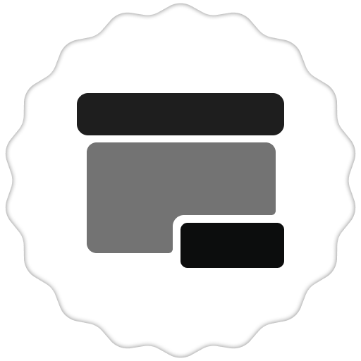
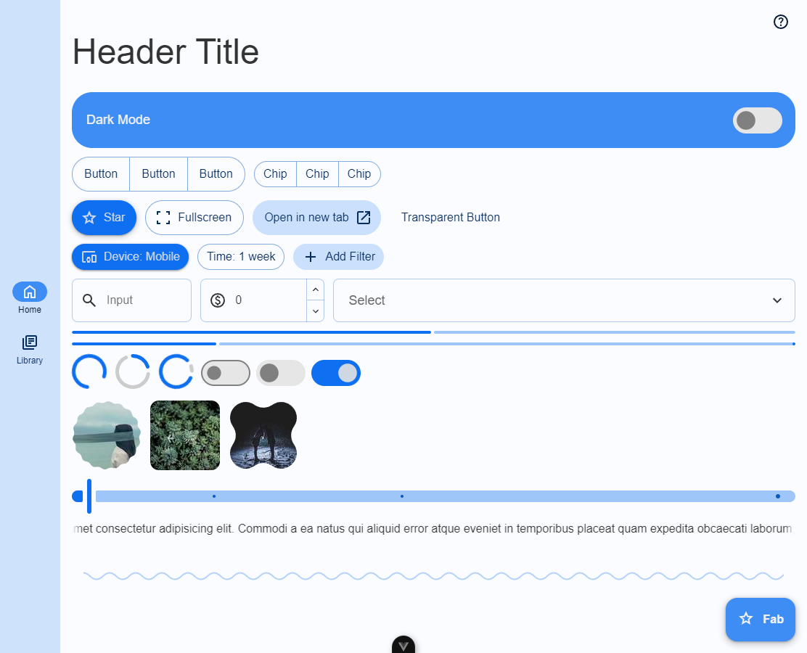
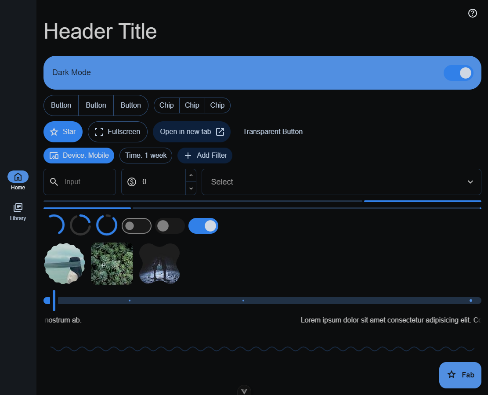

# MD Components

### Bootleg Material Components.

Recreated the [Material Design Components](https://github.com/material-components/material-components-web) for Vue3.

## Screenshots

## Components

- [Box](/src/components/Box)
- [Button](/src/components/Button)
- [Chip](/src/components/Chip)
- [Switch](/src/components/Switch)
- [Slider](/src/components/Slider)
- [Select](/src/components/Select)
- [Image](/src/components/Image)
- [Input](/src/components/Input)
- [List](/src/components/List)
- [Text](/src/components/Text)
- [Divider](/src/components/Divider)
- [Progress](/src/components/Progress)
- [Navigation](/src/components/Navigation)
- [Header](/src/components/Header)
- [Layout](/src/components/Layout)

## Docs

- None

## Get Started

- Clone the repository
- Install dependencies
  - `npm install` or `yarn` or `pnpm install` or `bun install`
- Open development server:
  - `npm run dev` or `yarn dev` or `pnpm dev` or `bun run dev`
- Build:
  - `npm run build` or `yarn build` or `pnpm build` or `bun run build`

## Contributing

If you have any questions or suggestions, please feel free to [open an issue](https://github.com/obillekyle/components/issues) or [open a pull request](https://github.com/obillekyle/components/pulls).
